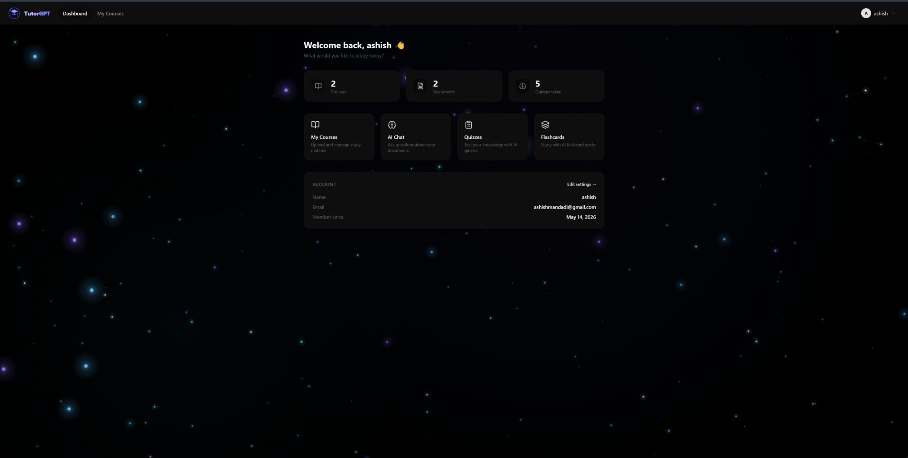
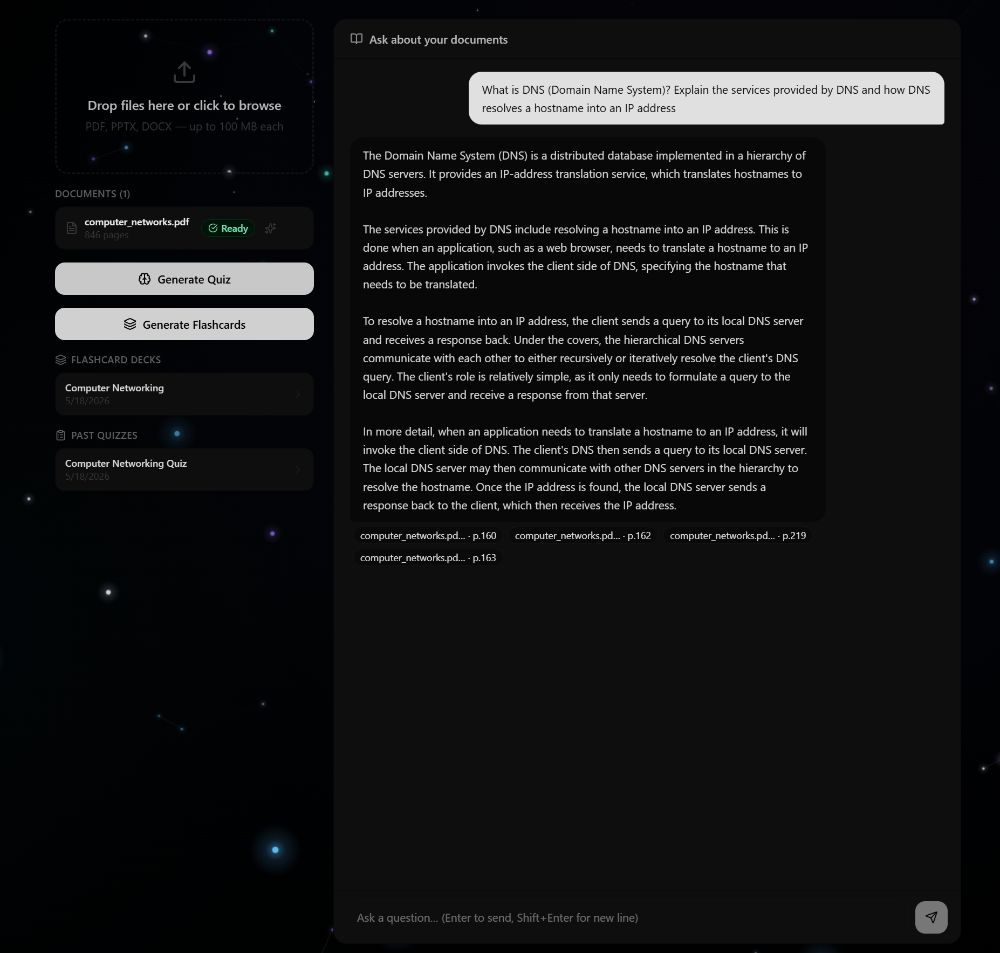
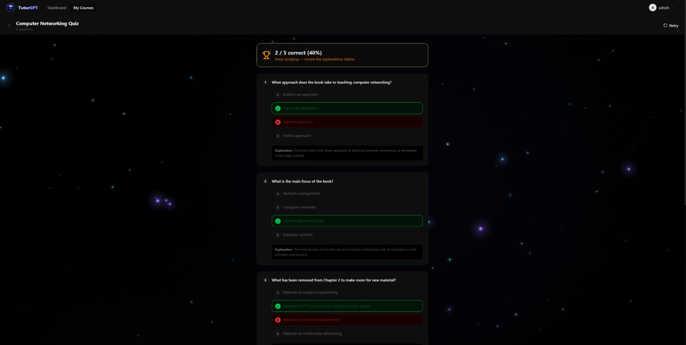
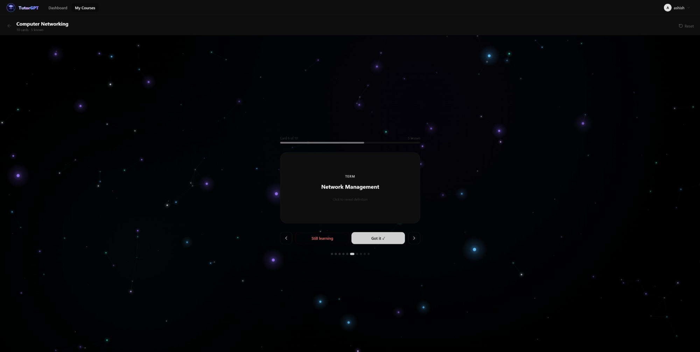

# TutorGPT — AI-Powered Personalized Tutoring Platform

> Upload your study material. Chat with it. Get quizzed on it. Master it.

TutorGPT is a full-stack AI tutoring web application that lets students upload course documents and interact with an intelligent tutor that answers questions **exclusively from their own content** using Retrieval-Augmented Generation (RAG). No hallucinations — every answer is grounded in what you uploaded.

---

## Key Engineering Highlights

- Built a microservice-based AI tutoring platform using **React 19, Spring Boot, FastAPI, ChromaDB, and Groq LLM**
- Implemented **JWT authentication**, protected routes, async document ingestion, RAG-based chat, quiz generation, flashcards, and AI summaries
- Designed a **modular monorepo architecture** with separate frontend, backend, and AI service layers
- Space-themed UI with a **live HTML5 Canvas neural network animation** rendered across all pages
- Document pipeline supports **PDF, DOCX, and PPTX** — chunked, embedded, and stored in ChromaDB for vector retrieval

---

## Features

| Feature | Description |
|---|---|
| **RAG Chat** | Ask questions about your documents and get cited answers sourced from your content |
| **AI Quizzes** | Auto-generate multiple-choice quizzes from any document with explanations |
| **AI Flashcards** | Generate term/definition flashcard decks with flip animation and progress tracking |
| **Document Summaries** | One-click AI summary of any uploaded document, shown inline |
| **Dashboard** | Overview of courses, documents, and quizzes taken |
| **Settings** | Update display name and change password |
| **Space UI** | Live animated neural network canvas background across all pages |

---

## Tech Stack

### Frontend
| Technology | Role |
|---|---|
| React 19 + Vite + TypeScript | UI framework and build tool |
| TailwindCSS v4 | Utility-first styling with `@theme` token remapping |
| shadcn/ui | Accessible component primitives |
| React Router v7 | Client-side routing with protected routes |
| TanStack Query (React Query) | Server state, caching, mutations |
| Zustand | Auth state + localStorage persistence |
| Axios | HTTP client with JWT interceptor |
| HTML5 Canvas | Live neural network space animation |

### Backend
| Technology | Role |
|---|---|
| Spring Boot 3.2 + Java 17 | REST API gateway |
| Spring Security + JWT (jjwt 0.12.6) | Stateless authentication |
| H2 File-based Database | Embedded SQL database (no install needed) |
| Flyway | Database schema migrations (V1–V6) |
| Spring `@Async` | Non-blocking document ingest pipeline |
| WebClient | Internal calls to the AI service |

### AI Service
| Technology | Role |
|---|---|
| Python FastAPI | AI microservice API |
| ChromaDB (embedded) | Vector store for document embeddings |
| LangChain | Document chunking + Groq LLM integration |
| Groq API — Llama 3.3 70B | LLM inference (free tier) |
| PyPDF2 | PDF parsing |
| python-docx | DOCX parsing |
| python-pptx | PPTX parsing |

---

## Architecture & Workflow

```
Browser (React 19)
      │
      │  REST + JWT
      ▼
Spring Boot (port 8080)
      │                    ┌──────────────────────────┐
      │  WebClient         │   Python FastAPI          │
      ├──────────────────► │   (port 8000)             │
      │                    │                           │
      │                    │  ┌─────────┐  ┌────────┐  │
      │                    │  │ChromaDB │  │ Groq   │  │
      │                    │  │(vectors)│  │  LLM   │  │
      │                    │  └─────────┘  └────────┘  │
      │                    └──────────────────────────┘
      │
      ▼
   H2 Database (file-based)
```

### How a user session works

1. **Sign up / Log in** — Spring Boot issues a JWT stored in `localStorage`
2. **Create a course** — logical container for documents and study tools
3. **Upload a document** — PDF, DOCX, or PPTX saved to disk, then asynchronously chunked and embedded into ChromaDB
4. **Chat** — question → Spring Boot → FastAPI → ChromaDB retrieves top-k chunks → Groq generates grounded answer with citations
5. **Generate a quiz** — document chunks sent to Groq → 10 MCQ questions with options and explanations stored in H2
6. **Generate flashcards** — same flow produces term/definition pairs stored as a deck in H2
7. **Summarize** — document chunks sent to Groq for a structured summary, stored per-document and shown inline

### Document ingest pipeline

```
Upload (multipart)
   │
   ▼
Spring Boot saves file to disk
   │
   ▼  (@Async — non-blocking)
POST /ingest → FastAPI
   │
   ├─ Parse (PDF → PyPDF2, DOCX → python-docx, PPTX → python-pptx)
   ├─ Chunk (LangChain RecursiveCharacterTextSplitter, 800 chars / 150 overlap)
   ├─ Embed (ChromaDB default embedding function)
   └─ Store in ChromaDB (collection per document)

Document status: PROCESSING → READY
```

---

## Project Structure

```
tutorgpt/
├── frontend/
│   ├── src/
│   │   ├── components/       Navbar, NeuralBackground, TutorGPTLogo, UploadZone, ui/
│   │   ├── pages/            Dashboard, Courses, Course, Quiz, Flashcards, Settings, Login, Signup
│   │   ├── services/         Axios API client with JWT interceptor
│   │   └── store/            Zustand auth store
│   └── vite.config.ts        Proxy: /api → :8080
│
├── backend/
│   └── src/main/
│       ├── java/com/tutorgpt/
│       │   ├── controller/   Auth, Course, Document, Quiz, Deck, Profile, Stats
│       │   ├── service/      Ingest, Quiz, Flashcard, Summary, AI gateway
│       │   ├── entity/       JPA entities
│       │   └── security/     JWT filter + config
│       └── resources/
│           └── db/migration/ Flyway V1–V6 SQL scripts
│
└── ai-service/
    ├── main.py               FastAPI app with all routers
    └── routers/
        ├── ingest.py         POST /ingest
        ├── query.py          POST /query
        ├── quiz.py           POST /generate-quiz
        ├── flashcards.py     POST /generate-flashcards
        └── summarize.py      POST /summarize
```

---

## Getting Started

> No Docker required. Run three services in separate terminals.

### Prerequisites
- Node.js 18+
- Java 17+
- Python 3.11 (recommended for ChromaDB/LangChain compatibility)
- A free [Groq API key](https://console.groq.com)

### 1. AI Service
```bash
cd ai-service
python -m venv venv
venv\Scripts\activate          # Windows
# source venv/bin/activate     # macOS/Linux
pip install -r requirements.txt
```

Create `ai-service/.env`:
```
GROQ_API_KEY=your_groq_api_key_here
```

```bash
uvicorn main:app --reload --port 8000
```

### 2. Backend
```bash
cd backend
./mvnw spring-boot:run         # Linux/macOS
mvnw.cmd spring-boot:run       # Windows
```

Starts on `http://localhost:8080`. H2 database auto-created at `backend/data/tutorgpt.mv.db`.

### 3. Frontend
```bash
cd frontend
npm install
npm run dev
```

Open **http://localhost:3000**

> Start order: AI Service → Backend → Frontend

---

## API Overview

### Spring Boot (port 8080)

| Method | Endpoint | Description |
|---|---|---|
| POST | `/api/auth/signup` | Register new user |
| POST | `/api/auth/login` | Login, returns JWT |
| GET/POST | `/api/courses` | List / create courses |
| DELETE | `/api/courses/:id` | Delete course |
| POST | `/api/courses/:id/documents` | Upload document (PDF/DOCX/PPTX) |
| DELETE | `/api/documents/:id` | Delete document |
| POST | `/api/courses/:id/chat` | RAG chat |
| POST | `/api/courses/:id/quiz` | Generate quiz |
| GET | `/api/quizzes/:id` | Get quiz with questions |
| POST | `/api/courses/:id/deck` | Generate flashcard deck |
| GET | `/api/decks/:id` | Get deck with cards |
| GET | `/api/stats` | Dashboard stats |
| PUT | `/api/profile` | Update display name |
| PUT | `/api/profile/password` | Change password |

### AI Service (port 8000)

| Method | Endpoint | Description |
|---|---|---|
| POST | `/ingest` | Parse, chunk, embed document |
| POST | `/query` | RAG query with citations |
| POST | `/generate-quiz` | Generate MCQ quiz |
| POST | `/generate-flashcards` | Generate flashcard deck |
| POST | `/summarize` | Summarize document |

---

## Database Schema

```
users           id, name, email, password_hash, created_at
courses         id, user_id, name, description, created_at
documents       id, course_id, name, file_path, status, summary, created_at
quizzes         id, course_id, document_id, title, created_at
quiz_questions  id, quiz_id, position, question_text, option_a/b/c/d, correct_option, explanation
flashcard_decks id, course_id, document_id, title, created_at
flashcards      id, deck_id, position, front, back
```

---

## Environment Variables

### `ai-service/.env`
```
GROQ_API_KEY=your_key_here
```

### Backend (`application.yml`)
All defaults work out of the box for local development. Configure via environment variables for production:

| Variable | Description |
|---|---|
| `AI_SERVICE_URL` | URL of the FastAPI AI service (default: `http://localhost:8000`) |
| `JWT_SECRET` | Secret key for signing JWTs |
| `UPLOAD_DIR` | Directory for uploaded files (default: `./uploads`) |

### Frontend
| Variable | Description |
|---|---|
| `VITE_API_URL` | Backend URL for production (leave empty for local dev) |

---

## Screenshots

### Login Page
> Space-themed neural network animation with the TutorGPT logo — the first thing users see.


---

### Dashboard
> At-a-glance stats for courses, documents, and quizzes taken. Quick access to all features.



---

### AI Chat
> Ask questions about your uploaded documents. Every answer is sourced directly from your content with citations.



---

### AI Quiz
> Auto-generated multiple-choice quiz with instant feedback — correct answers highlighted green, wrong ones red, with explanations.



---

### Flashcards
> AI-generated flashcard deck with flip animation, progress tracking, and "Got it / Still learning" flow.



---

## Built With

- [Groq](https://groq.com) — Ultra-fast LLM inference (free tier, no credit card)
- [ChromaDB](https://www.trychroma.com) — Embedded vector database
- [LangChain](https://langchain.com) — LLM framework and document processing
- [Spring Boot](https://spring.io/projects/spring-boot) — Java backend framework
- [Vite](https://vitejs.dev) — Frontend build tool
